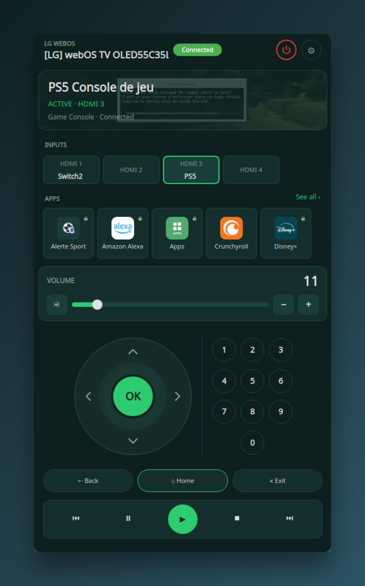
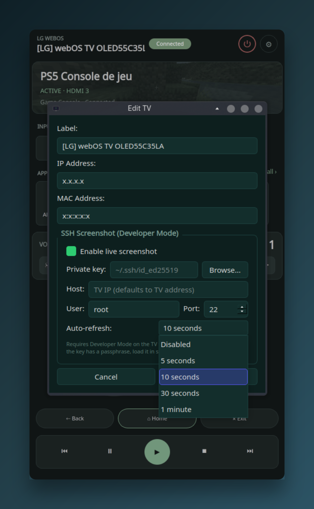
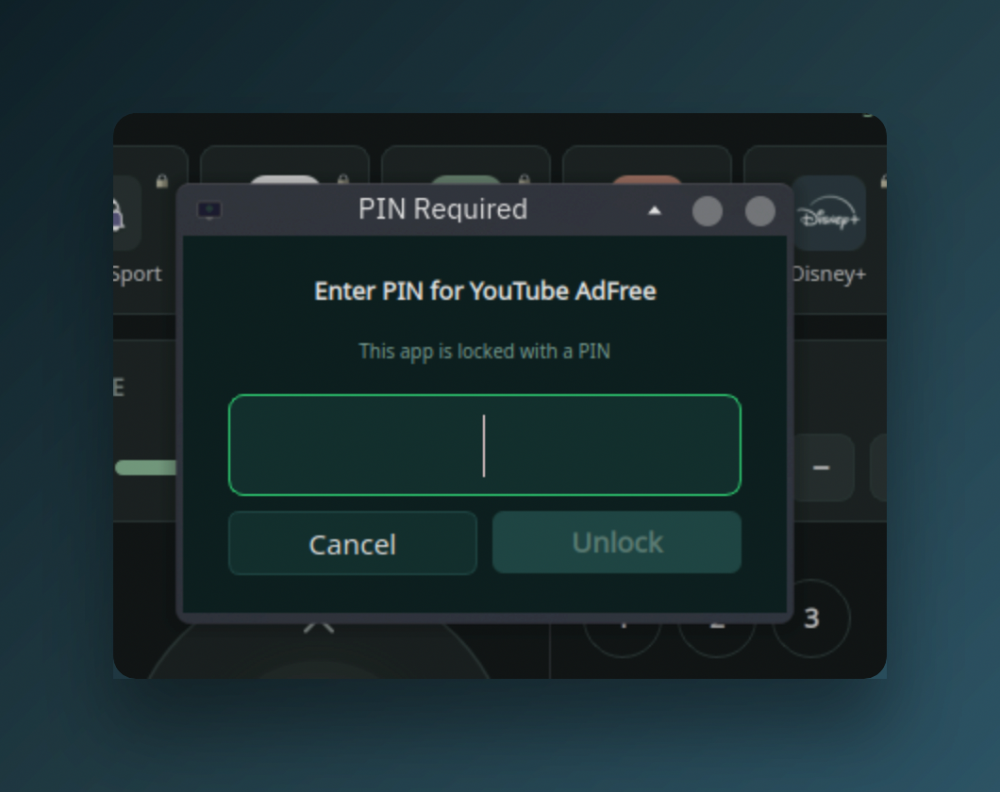

# LG TV Remote

Desktop remote control for LG webOS TVs. Connects over your local network
using the SSAP WebSocket protocol, with Wake-on-LAN for power-on.



## Features

- HDMI input switching with device labels and connection status
- App launcher with PIN unlock for locked apps
- Volume control and mute
- D-pad, numpad and media playback controls
- Live screenshot of the TV screen (requires SSH access)
- Auto-refresh screenshots at a configurable interval per TV
- Wake-on-LAN power on/off
- Keyboard shortcuts for navigation
- Auto-discovery of TVs on the local network via SSDP

## Screenshots

| Edit TV | PIN unlock |
|---------|------------|
|  |  |

The Edit TV dialog lets you configure SSH access for live screenshots.
When enabled, you can set an auto-refresh interval (5s, 10s, 30s, or 1 minute)
to keep the screenshot up to date.

## Prerequisites

**On the TV**: enable **Mobile TV On** so Wake-on-LAN works.

- Settings > General > Devices > TV Management > Mobile TV On
- The exact path varies by firmware version.

## Install

### Ubuntu 26.04+ / Debian (.deb)

Download the `.deb` from the [latest release](https://github.com/Zharkan/lgtv-remote/releases/latest) and install it:

```bash
sudo apt install ./lgtv-remote_*.deb
```

All dependencies are available in the official repos starting with Ubuntu 26.04 LTS (Resolute).
Earlier Ubuntu versions do not ship `python3-pyside6` and are not supported.

### Arch Linux (AUR)

```bash
yay -S lgtv-remote
```

### From source

```bash
sudo pacman -S pyside6 python-qasync
python -m venv --system-site-packages .venv
source .venv/bin/activate
pip install -e .
```

## Usage

```bash
# Activate the venv first
source .venv/bin/activate

# Run the app
lgtv-remote

# Development mode (no TV needed)
lgtv-remote --mock
```

On first launch a setup wizard discovers TVs on your network via SSDP.
When you select a TV, it connects and the TV displays a pairing prompt.
Accept it with the physical remote. The pairing key is saved for future
sessions.

### Keyboard shortcuts

| Key        | Action |
|------------|--------|
| Arrow keys | D-pad navigation |
| Enter      | OK / select |
| Backspace  | Back |
| Escape     | Exit |
| Home       | Home |

## Troubleshooting

### Pairing prompt not appearing

- Make sure no other app (e.g. Home Assistant) is actively connected.
  Some firmware versions only allow one SSAP client.
- Power-cycle the TV completely (unplug for 10 seconds).
- Try connecting from the verification script first:
  ```bash
  python scripts/verify_connection.py 192.168.10.42
  ```

### Wake-on-LAN not waking the TV

- Confirm **Mobile TV On** is enabled (see Prerequisites above).
- The TV must have been properly shut down (not hard power-off).
- Check that the MAC address in Settings matches the TV's wired
  ethernet MAC (Wi-Fi WoL is unreliable on most models).
- Some routers drop broadcast UDP. Try from a machine on the same
  switch/VLAN.

### Discovery finds nothing

- SSDP uses multicast UDP on 239.255.255.250:1900. If your network
  segments VLANs or has IGMP snooping without a querier, multicast
  won't cross segments.
- Use manual entry instead: Settings > Add TV > Enter manually.
- You need the TV's IP address (check your router's DHCP leases)
  and optionally the MAC address (printed on a label on the back).

## Development

```bash
source .venv/bin/activate
pip install -e ".[dev]"

# Run tests
pytest

# Run with mock TV (no hardware needed)
lgtv-remote --mock
```
